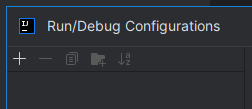
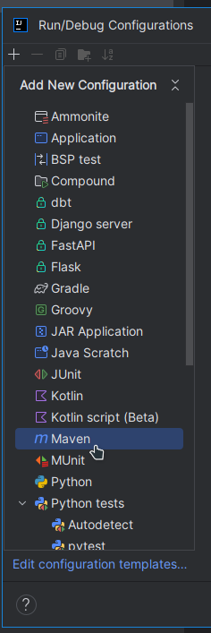
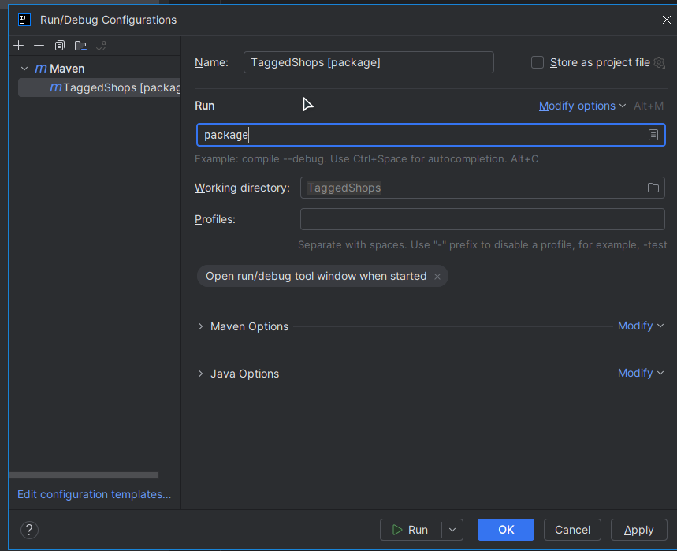
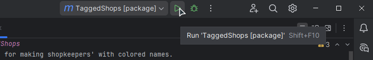

# TaggedShops
A plugin for making shopkeepers' with colored names.

[Download on Modrinth](https://modrinth.com/plugin/linux/)

## Building
Open the project in **IntelliJ IDEA**, click the **Current File** select box and click **Edit Configurations...**.

Now, click the plus button:

Select **Maven**:

and type `package`:

and click OK. Then, select the new task within that select box, and click the Run icon:

And boom, the JAR should be in the `target` folder, while I'm writing called `TaggedShops-1.2.jar`.
